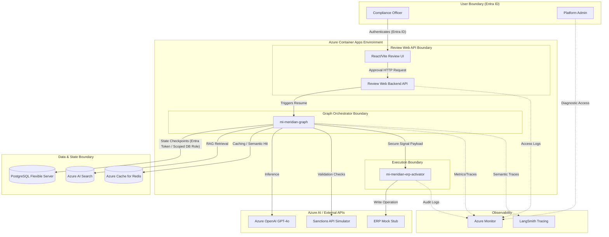
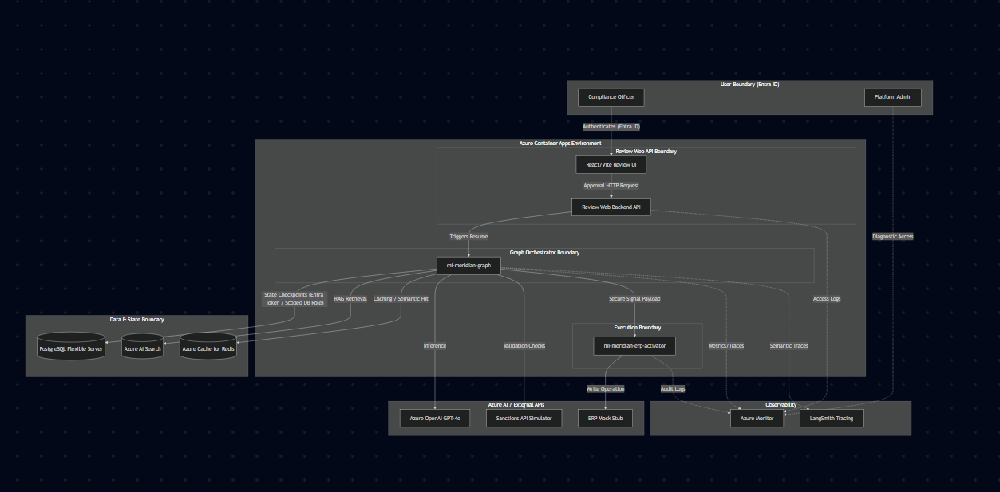

# ARCHITECTURE_DIAGRAM_V1

## Final D05 Architecture - Meridian Compliance Orchestrator

This artifact documents the final architecture approved at the Day 05 Architecture Review Board.

### Architecture Key Notes:
1. **PostgreSQL Checkpointing**: Based on ADR-002, Azure Database for PostgreSQL Flexible Server is used for LangGraph checkpointing relying on Entra ID for database connections instead of long-lived passwords. A dedicated bootstrap admin exists only to create constrained database roles; the graph runtime is not a server administrator.
2. **Review Web API Boundary**: Based on D05 Risk Matrix upgrades, the human CO does not speak directly to the graph payload webhook but interacts through a tightly-secured UI/API boundary enforcing idempotency and preventing API impersonation (R11).
3. **Execution Separation**: The Graph logic (`mi-meridian-graph`) is distinctly decoupled from the ERP invocation (`mi-meridian-erp-activator`), adhering to the core principle that the LLM engine does not bear ERP or server-level database administration scopes.
4. **Dual-Stack Observability**: Based on ADR-005, Azure Monitor collects the SLA infrastructural metrics (latency, crash rates, PII-bound audit boundaries) while LangSmith ingests transient semantic traces for ZT06 prompt evaluation.
